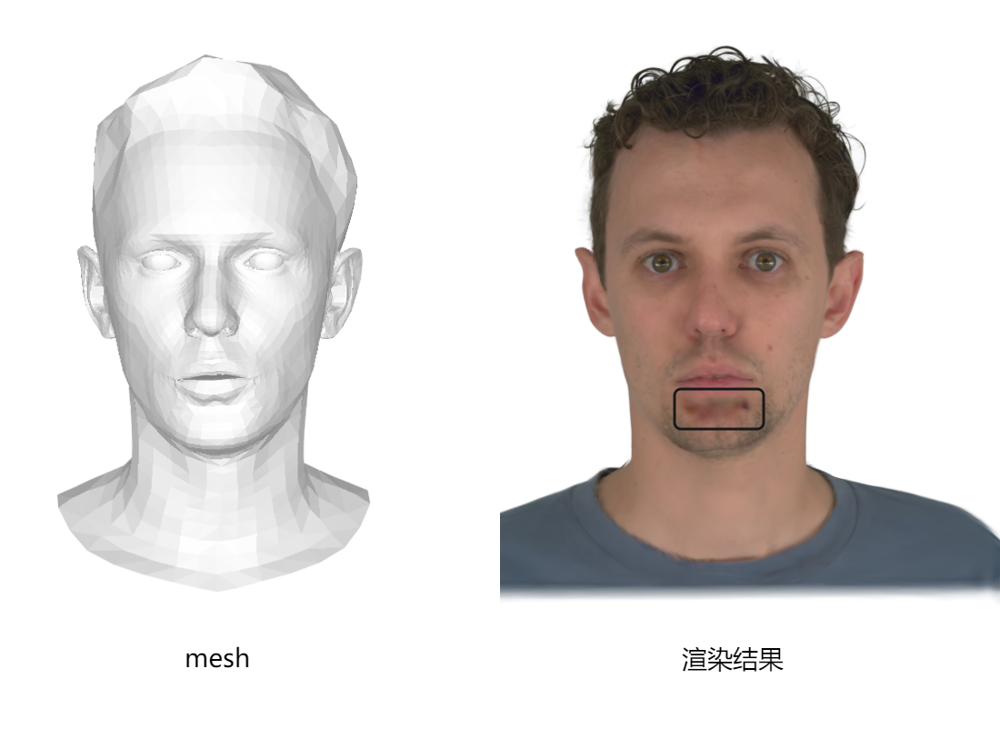

音频驱动3DGS头像系统
===========================  


# 0. 项目说明
研究生期间实现的3DGS头像音频驱动系统。

系统流程

<p align="center">

</p>

实验可视化结果
<video src="./imgs/方法对比_with audio_2.mp4" controls width="100%"></video>

系统实现部分，高斯头像优化基于[GaussianAvatars](https://github.com/ShenhanQian/GaussianAvatars)；几何的音频驱动基于[Unitalker](https://github.com/X-niper/UniTalker)。

评测部分，基于[syncnet](https://github.com/joonson/syncnet_python)，实现了口型、音频同步性指标LSE-C和LSE-D的评测。

# 1. Setup
## 环境安装
系统实现部分，参考[GaussianAvatars](https://github.com/ShenhanQian/GaussianAvatars)和[Unitalker](https://github.com/X-niper/UniTalker)。安装conda环境gaussian-avatars与unitalker。

注意，在使用gaussian-avatars环境时，常常需要执行以下命令：
```
export PATH=~/anaconda3/envs/gaussian-avatars/bin:$PATH
```

评测部分，参考[syncnet](https://github.com/joonson/syncnet_python)。安装conda环境syncnet。
## 下载
### 模型参数
系统实现的模型参数下载说明如下：

1. 目标样本的高斯头像信息，可以基于优化过程得到。也可从[谷歌云盘链接](https://drive.google.com/drive/folders/1zjuv9ZSbo9sQW6qsfUKEQSgzKhPQ-mNO?usp=sharing)下载一份测试头像信息，放置到`./GaussianAvatars/output`路径下。

2. Unitalker的模型参数，下载完成后置于`./UniTalker/pretrained_models`中

评测部分的模型参数说明：
1. syncnet根据[说明](https://github.com/joonson/syncnet_python)完成安装即可。


### 测试数据

参考[说明](https://github.com/ShenhanQian/GaussianAvatars/blob/main/doc/download.md)，可下载NeRSemble数据集（标注了逐帧FLAME、相机参数的多视角人脸视频数据），将其置于`GaussianAvatars/data`路径。


# 2.高斯头像优化
路径`./GaussianAvatars`
```
conda activate gaussian-avatars
```
简化版训练命令
```
python train.py
```

完整版训练命令
```
SUBJECT=306

python train.py \
-s ./GaussianAvatars/data/UNION10_${SUBJECT}_EMO1234EXP234589_v16_DS2-0.5x_lmkSTAR_teethV3_SMOOTH_offsetS_whiteBg_maskBelowLine \
-m output/UNION10EMOEXP_${SUBJECT}_eval_600k \
--eval --bind_to_mesh --white_background --port 60000
```

# 3.高斯头像音频驱动
## 3.1 生成输入音频对应的FLAME几何形变序列
路径`./Unitalker`
```
conda activate unitalker
```
推理阶段，输入音频、输出几何形变序列通过`unitalker.yaml`指定，输出几何形变序列也可通过命令行指定。

基于FLAME格式的人脸几何形变量被保存至`UniTalker/audio_driven_D1_deformation`
```
python -m main.demo --config config/unitalker.yaml test_out_path ./test_results/demo.npz
```

## 3.2 基于几何形变序列，生成目标样本的几何mesh
注意。本实验基于目标样本几何mesh的FLAME参数完成了牙齿区域的几何补全。

路径`./GaussianAvatars/`


```
conda activate gaussian-avatars
python audio_deformation_convert.py
```

## 3.3 利用目标人脸几何mesh，生成3DGS驱动头像结果

利用目标人脸几何mesh，生成3DGS驱动头像结果
```
python render.py
```
与消融实验相关，检查各个人脸分割(face parsing)部分对应的渲染结果。
```
python render_face_parsing_check.py
```

# 4 结果评测
目前实现了LSE-C和LSE-D的评测。

这种评测指标常用于评测合成视频中音频、口型的一致性。

实践发现，这一指标对人脸在画面中心的对齐性要求较高；且对于音频、口型一致性差一些的合成视频，有时指标的好坏和主观感受并不一致。

具体操作如下：

路径：`./evaluate/syncnet_python`
```
conda activate syncnet
```

修改`cmd_for_evaluate.sh`中的音频、视频文件路径，然后执行该文件
```
./cmd_for_evaluate.sh
```
完成后，会在终端输出该音频、视频的一致性指标。

如需进行逐帧裁剪，用于展示等场合，可执行脚本。
```
python video_crop.py
```

# 5.讨论
讨论写于25年5月。
1. 本系统在处理某些动作时，出现了一些需要解决的瑕疵（如下图所示），初步查看为嘴唇需要进一步优化，需要进一步定位一下问题产生原因。
这是GaussianAvatars和Unitalker两个模块间兼容性的问题。


    <p align="center">
    
    </p>

    一些工作（如[GaussianSpeech](https://github.com/shivangi-aneja/GaussianSpeech)）尝试将两个阶段联合训练。这可能有助于解决兼容性问题。

2. GaussianAvatars和Unitalker两个模块均存在优化空间。
如，本系统出于多样场景适应能力的原因使用GaussianAvatars作为高斯头像的生成框架。
已有一些工作尝试了从多个维度对GaussianAvatars的改进（如[SplattingAvatar](https://github.com/initialneil/SplattingAvatar)、[FlashAvatar](https://github.com/USTC3DV/FlashAvatar-code)、[STGA](https://arxiv.org/abs/2503.05196)等），提升其性能或应用灵活性。

    值得一提的是：一些工作尝试（如[LAM](https://github.com/aigc3d/LAM)）减少高斯头像的获取难度（本系统基于多视角视频来训练高斯头像），有助于增强系统的应用灵活性。

# 6. 引用
1. [GaussianAvatars](https://github.com/ShenhanQian/GaussianAvatars)
2. [UniTalker](https://github.com/X-niper/UniTalker)
3. [syncnet](https://github.com/joonson/syncnet_python)